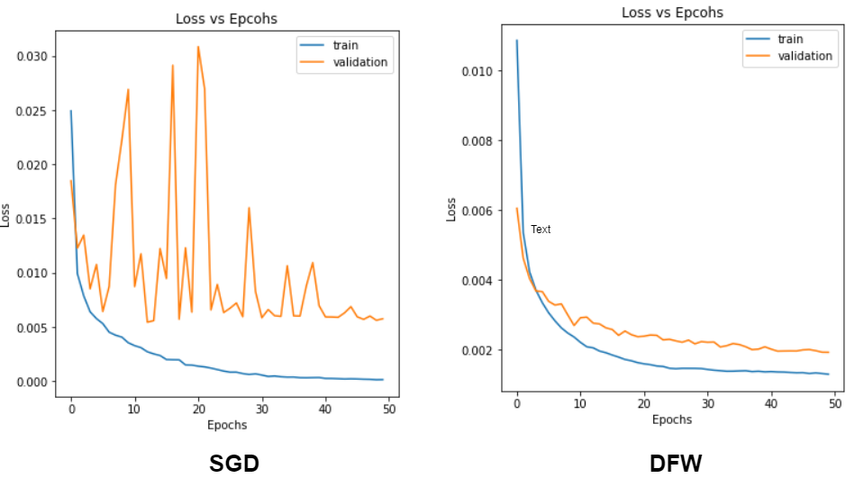

# Generalization Analysis of Deep Frank Wolfe Algorithm
Deep Frank-Wolfe(DFW) algorithm, is an extension of the classical Frank-Wolfe algorithm designed for solving optimization problems, particularly in the context of training neural networks with linear constraints. Traditional Frank-Wolfe is computationally more
computationally more expensive than SGD, so a variant, ”Deep Frank-Wolfe” (DFW) with computational efficiency similar to SGD was proposed by the authors of [1]. The purpose of the study is to test the generalization capacity of the models trained using the proposed DFW algorithm.

A simple CNN model was designed and tested against different datasets like MNIST, CIFAR10. 
- Claims by the authors regarding higher learning rates leading to better generalization were tested.
- Tested under varying regularization parameter settings.
- Behavior against finetuning of pretrained models (VGG11).
- Teseted the capacity to produce models that work well under a transfer learning setting.

DFW algorithm provides a much smoother loss curve when used for finetuning.

For further details and in-depth analysis, please check out the "Report_and_findings.pdf" file attached in the repo.

The only requirements to run the repo are torch and torchvision. To replicate the experiments and results, use the "Experiments.ipynb" file.

## References
1. A. Z. Leonard Berrada and M. P. Kumar, “Deep frank-wolfe for neural network optimization,” 2019.
2. Sebastian Pokutta, Christoph Spiegel and Max Zimmer, "Deep Neural Network Training with Frank-Wolfe", 2020.